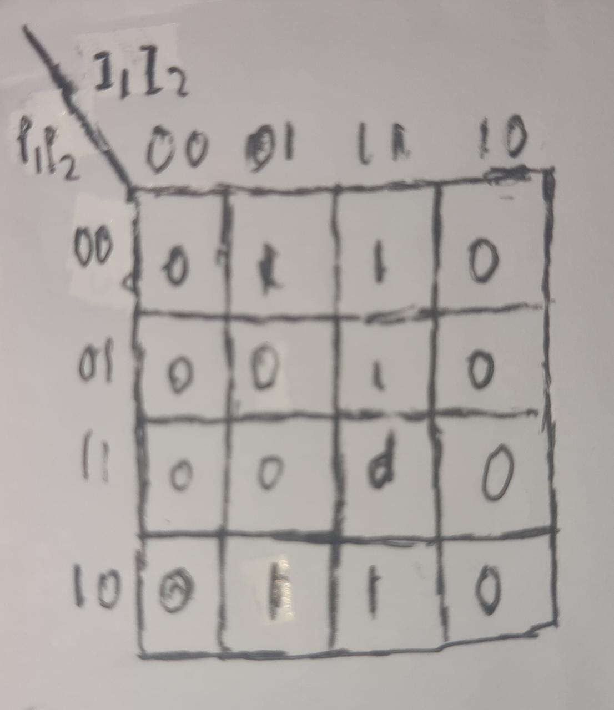
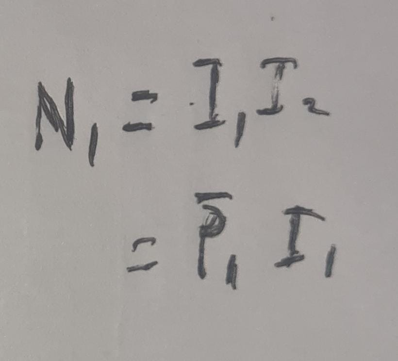

simple FSM for a cars turn signal

the system uses inputs from 2 buttons to either turn on the light, turn on the left lightrs, turn on the right lights, or turn on both lights.

there are 2 inputs:
- left button
- right button
which has an input:
- (1) = if it is pressed
- (2) = if it is not pressed
which means there are 4 possible inputs:
- (00) = no buttons pressed
- (10) = left button pressed
- (01) = right buttton pressed
- (11) = both buttons pressed

there are also 4 states that are possible:
- (00) = both lights off
- (10) = left light on
- (01) = right light on
- (11) = both lights on

here are the visualizations of the FSM system:
# state diagram

# truth table

the truth table of the diagram:

the table simplified:

# karnaugh map and combinational boolean equations
then, i made a karnaugh map and its combinational boolean equations:

which has the equation:

which has the equation

----------------------------------------------------------------------------------------------------------------------------
to run it u need to type these commands in terminal

gcc -c mylib/mylib.c -o mylib.o 
MinGW32-make 
./main.exe

to run it again type :
./main.exe

to stop the program press the q button on the keyboard

 this program works on windows by using conio.h
